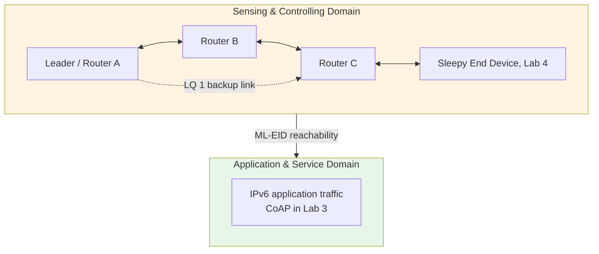

# Lab 2: Thread Mesh — Addressing, Multi-Hop and Self-Healing

**GreenField Technologies — SoilSense Project** · Phase: Core Connectivity · 2–3 hours

**From:** Edwin (Field Operations Lead)
**Subject:** URGENT: Tractor incident & network gaps

> Team — the Lab 1 range tests were promising, but a pilot farmer just drove a tractor
> over a sensor node, and everything that relied on it went dark. We cannot depend on any
> single node. We are going with **Thread**: an IPv6 mesh over the same 802.15.4 radio,
> where every router forwards for its neighbours. I need three answers:
>
> 1. **Coverage:** can a node reach the gateway through other nodes when it is out of
>    direct range?
> 2. **Resilience:** if a router dies, does the network heal in **under 2 minutes**?
> 3. **Latency:** what does each extra hop cost? Valve control needs to know.
>
> — Edwin

| Stakeholder | Their question | How this lab helps |
|---|---|---|
| **Edwin (Ops)** | "If a cow steps on a node, does the network survive?" | Part 4 kills a router mid-ping and times the recovery. |
| **Samuel (Architect)** | "What does a hop cost, and which address should our apps use?" | Part 2 classifies the addresses; Part 3 measures RTT over 1 and 2 hops. |
| **ISO 30141 auditor** | "How do devices reach each other inside the sensing domain?" | You extend the SCD's proximity network into a routed mesh. |

Unfamiliar terms (RLOC, ML-EID, REED, link margin…) are in the [glossary](../glossary.md).
Done early? [SOP-02: 6LoWPAN and Routing Experiments](sops/sop02_6lowpan.md) uses the same
firmware to watch fragmentation happen and to kill the leader instead of a router.

---

## Background: what Thread adds to Lab 1

Lab 1 gave you the bottom two layers: an 802.15.4 PHY and MAC with 127-byte frames. Thread
stacks three things on top:

- **6LoWPAN** compresses the 40-byte IPv6 header (often to a few bytes) and fragments
  datagrams that still don't fit in one frame.
- **IPv6 addressing**: every node carries several addresses with different jobs. Part 2
  sorts them out.
- **MLE (Mesh Link Establishment)** discovers neighbours, rates each link, and lets routers
  share their routing tables so packets can travel through other nodes.

Each link gets a **link quality** (LQ 0–3) from its *link margin*, the received signal
minus the noise floor: above 20 dB is LQ 3, above 10 dB LQ 2, above 2 dB LQ 1. LQ 3, 2
and 1 cost 1, 2 and 4, and a route costs the sum of its links. Thread therefore prefers two
good hops (cost 2) over one bad link (cost 4). Part 3 relies on exactly that.

> **In other stacks:** BLE Mesh floods every message through every relay, and Zigbee routes
> along an address tree with on-demand repairs. Same problem, different trade-offs between
> state, airtime and healing speed.

## Part 1 — Setup

**Per group:** **3** ESP32-C6 boards (DevKitC-1, DevKitM-1 or Super Mini; mixing is fine) and
USB-C cables. Team up with another pair;
the spare board is useful for SOP-02. Call the boards **A**, **B** and **C**, with one
laptop and monitor per board.

**Task 1.1** — flash [`firmware/lab2_mesh`](../../firmware/lab2_mesh) to all three. It is
the Lab 1 firmware plus MAC filtering, which Part 3 uses to shape the topology on a desk,
and an RGB LED that shows the board's Thread role:

```bash
source ~/zephyrproject/env.sh
cd firmware/lab2_mesh

west build -p always -b esp32c6_devkitc/esp32c6/hpcore .
west flash
west espressif monitor -p /dev/ttyUSB0
```

Same port rule as Lab 1: use the board's **UART** port, and on a Super Mini build with the
USB console options from Lab 1 Task 1.1 (`usb_console.conf` / `usb_console.overlay` are in
this folder too). Run `ot factoryreset` on every board first, because the Lab 1 dataset
survives reflashing.

| LED | Role |
|---|---|
| off | disabled: Thread not started |
| red | detached: looking for a network |
| yellow | child |
| green | router |
| blue | leader |

With three boards on a desk you can watch the whole mesh form at a glance.

**Task 1.2** — form one network with A as the leader. Same TX power on all three boards:

```bash
# All three:
uart:~$ ot txpower 0

# A:
uart:~$ ot dataset init new
uart:~$ ot dataset channel 15            # your ADR-001 channel
uart:~$ ot dataset commit active
uart:~$ ot ifconfig up
uart:~$ ot thread start
uart:~$ ot state                         # leader
uart:~$ ot dataset active -x             # copy the hex string

# B and C:
uart:~$ ot dataset set active <hex from A>
uart:~$ ot ifconfig up
uart:~$ ot thread start
uart:~$ ot state                         # child, then router within ~2 min
```

`dataset init new` draws a random PAN ID, extended PAN ID and network key, which is why
the whole dataset is copied rather than typed in. Wait until B and C both report `router`
(LED green).

> If B or C turns blue for a moment, it started before it heard A and formed a partition of
> its own. Partitions that hear each other merge, so it falls in line within a minute.

**Task 1.3** — check the mesh from A:

```bash
uart:~$ ot router table
| ID | RLOC16 | Next Hop | Path Cost | LQ In | LQ Out | Age | Extended MAC     | Link |
+----+--------+----------+-----------+-------+--------+-----+------------------+------+
| 10 | 0x2800 |       63 |         0 |     0 |      0 |   0 | 2a4f9c1d0e7b6a58 |    0 |
| 22 | 0x5800 |       47 |         1 |     3 |      3 |   4 | 8e21c4a07f3b5d12 |    1 |
| 47 | 0xbc00 |       22 |         1 |     3 |      3 |   7 | 16d0e9b2a4c87f30 |    1 |
```

One row per router, A's own included (Link 0). `Link 1` means a direct radio link; LQ In is
what A measures, LQ Out what the neighbour reports back. At desk distance every link is LQ 3.
Next Hop and Path Cost describe the best *relay* towards that router and the cost from the
relay onward. A forwards through the relay only when that is cheaper than the direct link:
here direct costs 1 and the relay 1 + 1 = 2, so A talks to B and C directly.

## Part 2 — Who is who: Thread addresses

**Task 2.1** — on each board, list the unicast addresses:

```bash
uart:~$ ot ipaddr
fdde:ad00:beef:0:0:ff:fe00:fc00          # only on the leader
fdde:ad00:beef:0:0:ff:fe00:5800
fdde:ad00:beef:0:6a1b:3c4d:9e2f:1a07
fe80:0:0:0:8c21:c4a0:7f3b:5d12
uart:~$ ot ipaddr mleid
uart:~$ ot ipaddr rloc
uart:~$ ot rloc16
uart:~$ ot extaddr
```

Classify every address in your DDR:

| Type | Pattern | Scope | Used for |
|---|---|---|---|
| Link-local | `fe80::/64` | one radio hop | MLE between neighbours |
| RLOC (routing locator) | `<mesh-local prefix>:0:ff:fe00:<RLOC16>` | whole mesh | routing; encodes where the node is attached |
| ALOC (anycast locator) | `<mesh-local prefix>:0:ff:fe00:fcXX` | whole mesh | a role, not a device; `fc00` is "the leader" |
| ML-EID (mesh-local EID) | `<mesh-local prefix>:<random IID>` | whole mesh | the node's identity; what applications use |

**Task 2.2** — check two derivations with your own numbers:

1. The link-local IID is the extended MAC address with one bit flipped: compare `ot extaddr`
   with the `fe80::` address. Which bit, and in which byte?
2. The RLOC16's top 6 bits are the router ID: `0x5800 >> 10 = 22`. Confirm it against
   `ot router table`.

**Task 2.3** — `ot ipmaddr` lists the multicast groups. Find `ff02::1` (all nodes on this
link), `ff03::1` (all nodes in the mesh) and `ff02::2`/`ff03::2` (routers only, so they
vanish on a child).

> The RLOC is built from the router ID, so it changes whenever a node re-attaches somewhere
> else. The ML-EID is random and stays the same. You'll see why that matters in Part 4.

## Part 3 — Two hops on a desk

Three boards on one desk all hear each other. To make A reach C through B, tell A and C
that their direct link is poor. `macfilter rss add-lqi` fixes the link quality the
receiver assigns to frames from one address; the frames themselves still arrive:

```bash
# On A (C's extended address from `ot extaddr` on C):
uart:~$ ot macfilter rss add-lqi <C-extaddr> 1
# On C:
uart:~$ ot macfilter rss add-lqi <A-extaddr> 1
```

**Task 3.1** — within a minute or so, `ot router table` on A shows C's row with **LQ In 1**
and **LQ Out 1**. Compare costs: direct A→C is now 4; through B it is 1 + 1 = 2.

The table only shows costs. Prove the packets really go through B with B's MAC counters:

```bash
# On B:
uart:~$ ot counters mac reset
# On A:
uart:~$ ot ping <C-mleid> 64 20 0.5
# On B:
uart:~$ ot counters mac                  # TxUnicast ≈ 40: 20 requests + 20 replies relayed
```

Run the same check once *before* adding the filters: B's `TxUnicast` stays near zero.

**Task 3.2** — measure RTT by ML-EID, 20 pings of 64 bytes (same size as Lab 1):

```bash
uart:~$ ot ping <B-mleid> 64 20 0.5      # 1 hop
uart:~$ ot ping <C-mleid> 64 20 0.5      # 2 hops, through B
20 packets transmitted, 20 packets received. Packet loss = 0.0%. Round-trip min/avg/max = 12/18.400/31 ms.
```

| Path | Hops | RTT min / avg / max (ms) | Loss |
|---|---|---|---|
| A → B | 1 | | |
| A → C | 2 | | |
| Lab 1 A → B | 1 | | |

Run them one at a time; a second ping on the channel inflates both. The first ping to a
new ML-EID may be lost while A looks up where that address lives (a Thread address query);
it is not a radio loss.

## Part 4 — The tractor test

B is now the only good path between A and C. Kill it while traffic flows. Never unplug A:
it is the leader, and losing the leader is a different experiment (SOP-02).

**Task 4.1** — on A, one ping per second for a little over 3 minutes:

```bash
uart:~$ ot ping <C-mleid> 64 200 1
```

After about ten successful replies, **unplug B** and note the time. Replies stop, then
resume through the direct A–C link. Each missing reply is about one second of outage;
the summary's loss count gives you the healing time.

**Task 4.2** — post-mortem on A: in `ot router table`, C's row shows Next Hop 63, so A now
sends to C directly over the LQ 1 link. B's row lingers with LQ Out 0 and disappears after
about 100 s.

**Task 4.3** — plug B back in. Auto-start is off, so run `ot ifconfig up` and
`ot thread start` on B again (the dataset is still saved). Wait for `router`, then confirm
in A's router table that C's Next Hop is B again. Repeat 4.1 two more times and record all
three healing times.

| Run | Pings lost | Healing time (s) | Route after |
|---|---|---|---|
| 1 | | | |
| 2 | | | |
| 3 | | | |

Clean up when done: `ot macfilter rss clear` on A and C, `ot thread stop` on all boards.

## Part 5 — The "why" questions (DDR Section 5)

1. **How does a 40-byte IPv6 header fit in a 127-byte frame?** Look at your RLOC and
   ML-EID: which one's interface ID can the receiver rebuild from the MAC header, and which
   has to be sent? (Key terms: IPHC, context-based compression, IID.)
2. **Why did healing take seconds and not minutes?** Thread forgets a silent neighbour
   router after 100 s without hearing it. Your pings recovered much faster. What told A and
   C that B was gone? What would happen on a link that carries no traffic?
   (Key terms: MAC ACK, link failure, MLE advertisement.)
3. **Why does Part 4 need a *poor* A–C link instead of *no* link?** What would a MAC
   deny-list on A and C have done to your tractor test, and what does that mean for node
   spacing in Daniela's field?
4. *(Optional)* **Why do applications use the ML-EID?** Ping C by its RLOC, then make C
   re-attach elsewhere (stop B and restart C with `ot thread stop` / `ot thread start`).
   What happens to the old RLOC?

## ISO/IEC 30141 mapping

The mesh lives in the **SCD**: routers, links and MLE are its communication subsystem.
Stable ML-EIDs are what lets **ASD** services address individual nodes from Lab 3 on.



**Functional viewpoint (DDR Section 4):** map each Thread role to its function and power
profile: leader (network coordination: router IDs, network data), router (forwarding),
REED (standby forwarder), end device and sleepy end device (leaf; only the SED can sleep).
Routers keep their receiver on all the time; say what that means for the 3-month battery
target from Lab 1.

## Deliverables

1. **DDR update** — Section 3: **ADR-002 (Topology)**: Thread mesh vs a LoRaWAN-style star
   for this field, with your latency and healing numbers as evidence. Section 4: address
   classification table and the Thread-role mapping. Section 5: the "why" answers.
   Section 10: the RTT table and the three tractor runs. If you did SOP-02, add it under
   "Advanced Experiments".
2. **Summary for Edwin** (three lines): healing time, whether it meets < 2 min, and what a
   field tech should check when a node goes dark (neighbours in range, `ot router table`).
3. **Summary for Samuel** (three lines): cost per hop, which address type the firmware
   must use, and why.

## Grading (100 pts)

| | pts |
|---|---|
| **Technical execution** — 3-router mesh formed (5) · address classification incl. derivations (10) · 1- vs 2-hop RTT (10) · three tractor runs with healing times (15) | 40 |
| **ISO/IEC 30141** — Thread roles in the Functional viewpoint (15) · SCD/ASD mapping (10) · ADR-002 format (5) | 30 |
| **First principles** — Q1 IPHC (7) · Q2 failure detection (7) · Q3 redundancy (6) | 20 |
| **Communication** — Edwin summary (5) · Samuel summary (5) | 10 |
| **Ethics (pass/fail)** — your own network only (random dataset); radios off after testing | ✓ |

## Resources & next week

[OpenThread CLI reference](https://openthread.io/reference/cli/commands) ·
[Thread primer: IPv6 addressing](https://openthread.io/guides/thread-primer/ipv6-addressing) ·
[Thread primer: router selection](https://openthread.io/guides/thread-primer/router-selection) ·
RFC 6282 (6LoWPAN header compression) ·
[references.md](../references.md)

**Lab 3:** CoAP and CBOR. Samuel's next question: *"We have a mesh that routes IPv6. How do
applications talk over it, and why not just use HTTP?"*
