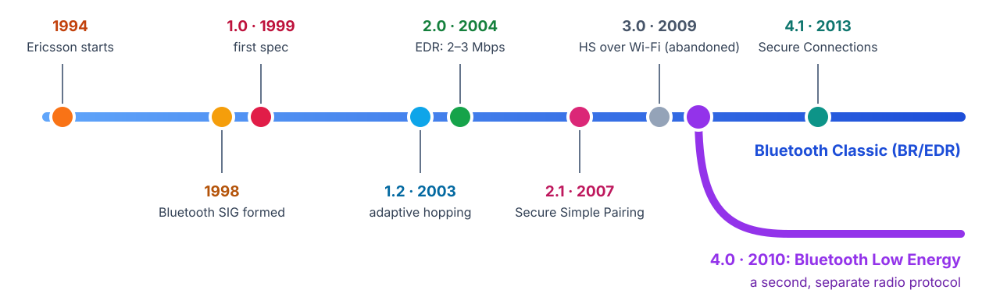
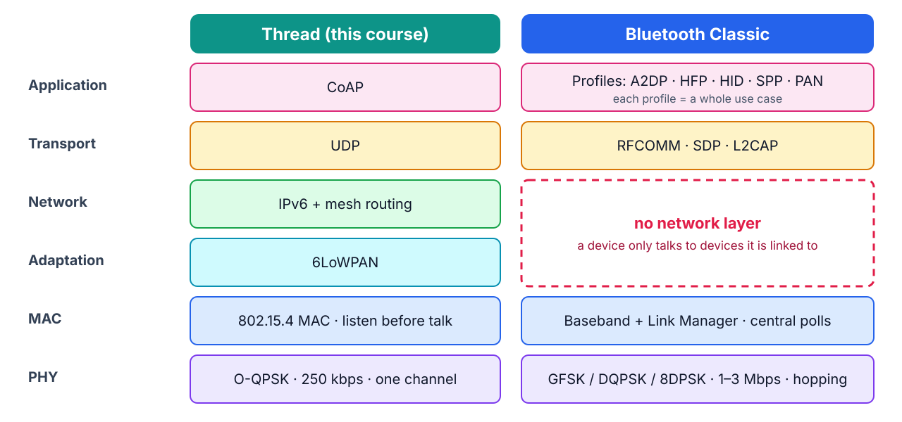
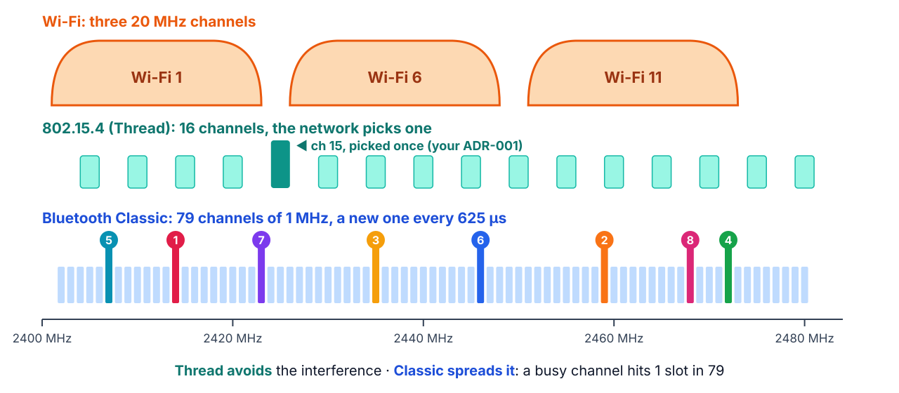
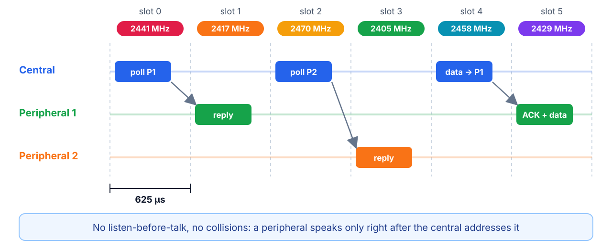
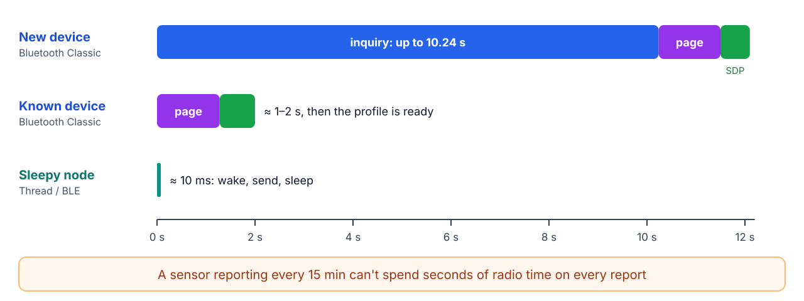
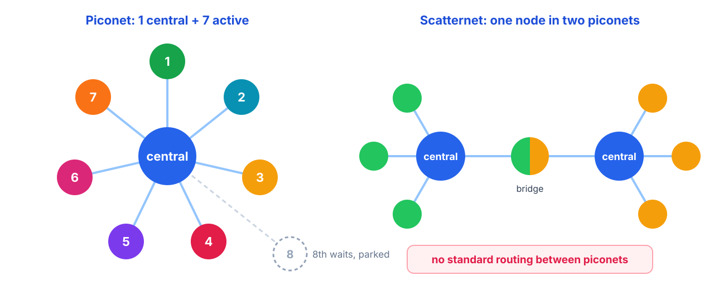
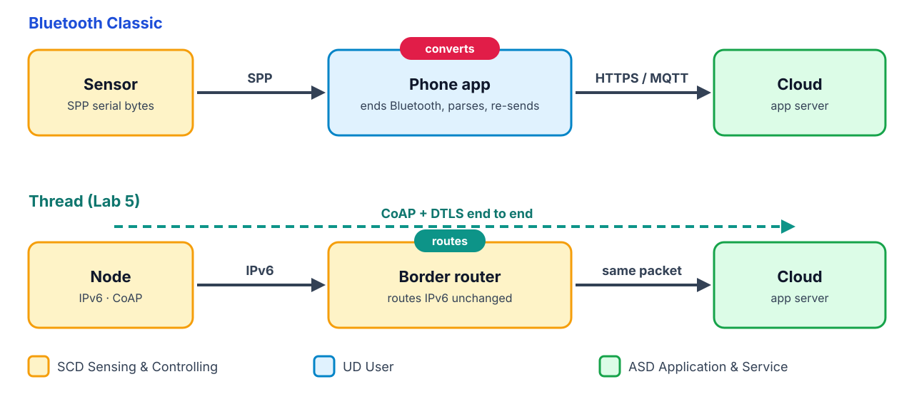
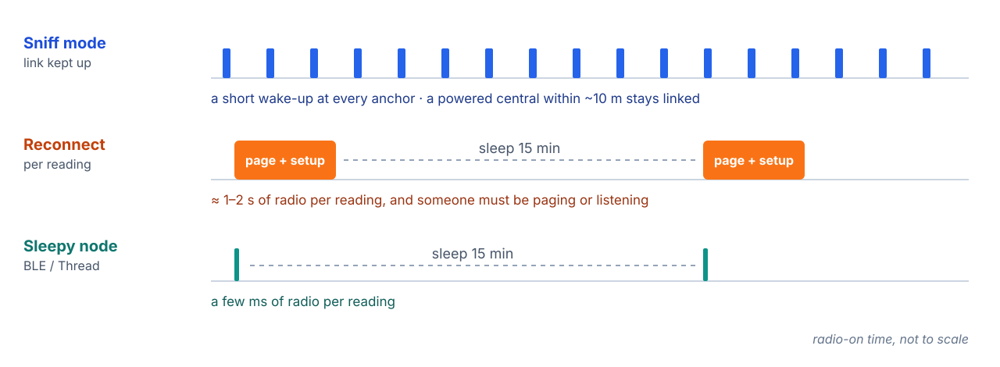

<!-- _class: lead -->
<!-- _paginate: false -->

# Bluetooth Classic (BR/EDR)

**Technology presentation 0** · the worked example of the template every group follows

The Bluetooth in your headphones, your car, and the HC-05 module from your Arduino projects.

<!--
0:00–0:30. Ask who has used an HC-05, Bluetooth headphones, a car hands-free kit.
Everyone has used Bluetooth Classic; almost nobody builds IoT sensors with it any more.
Today: why.
-->

---

<!-- _class: template -->

## The template: what every group presents

1. **Why it exists**: the problem and the history
2. **PHY/MAC**: band, modulation, rate, channel access, frame size
3. **Topology and range**
4. **IP-native or not**: where the protocol ends, what the gateway does (ISO/IEC 30141)
5. **Power**: battery life for a soil sensor reporting every 15 min
6. **Cost and ecosystem**
7. **Verdict for GreenField**: when you'd pick it over Thread, in one sentence

The colored tag at the top of each slide tells you which step you're in.

<!--
0:30–1:00. This deck is the worked example: same seven headings, ~20 min, 5 min of
questions. Grading follows the headings.
-->

---

<!-- _class: why -->
<!-- _header: 1 · Why it exists -->

## Replace the cable



Ericsson wanted to drop the RS-232 cable between phones and accessories. **BR/EDR** (Basic Rate / Enhanced Data Rate) is the official name; since 4.0 the spec holds **two different radios**.

<!--
1:00–2:30. SIG founders: Ericsson, IBM, Intel, Nokia, Toshiba. The name: a 10th-century
Danish king who united tribes. The design goal was a cable, a continuous link between
two devices. Everything else follows from that.
-->

---

<!-- _class: why -->
<!-- _header: 1 · Why it exists -->

## Where it sits: Classic next to Thread



**Profiles** standardize whole use cases (A2DP audio, HFP calls, **SPP** = your HC-05).

<!--
2:30–4:00. Leave the two-stack drawing from the Lab 1 lecture on the board next to this.
SDP lets a device ask "which profiles do you support?". The red box is the key: no
network layer, so a device talks only to devices it is linked to.
-->

---

<!-- _class: phy -->
<!-- _header: 2 · PHY/MAC -->

## PHY: pick one channel, or hop across all of them



<!--
4:00–5:30. Callback to the Lab 1 Wi-Fi overlap drawing and ADR-001. Classic hops 1600
times per second in a pseudo-random order both ends compute; adaptive frequency hopping
(1.2) drops channels that keep failing.
-->

---

<!-- _class: phy -->
<!-- _header: 2 · PHY/MAC -->

## PHY: rates and range

| Mode | Modulation | Rate |
|---|---|---|
| Basic Rate | GFSK | 1 Mbps |
| EDR 2M | π/4-DQPSK | 2 Mbps |
| EDR 3M | 8DPSK | 3 Mbps (~2.1 Mbps usable) |

| Power class | Max TX power | Typical range |
|---|---|---|
| Class 1 | 100 mW (+20 dBm) | ~100 m |
| Class 2 | 2.5 mW (+4 dBm) | ~10 m: phones, headsets |

Compare 802.15.4: 250 kbps, and your Lab 1 range test at 0 dBm.

<!--
5:30–6:30. Classic is 4–12× faster than 802.15.4. Ask: "Why didn't speed win?" Answer
comes on the power slide.
-->

---

<!-- _class: phy -->
<!-- _header: 2 · PHY/MAC -->

## MAC: the central polls, nobody contends



Packets span 1, 3 or 5 slots: up to **339 B** (Basic Rate) or **1021 B** (EDR), vs 802.15.4's 127. **ACL** links carry data; **SCO/eSCO** reserve slots for voice.

<!--
6:30–8:30. Ask: "What was the MAC family in 802.15.4?" → contention (CSMA-CA). "Here?"
→ scheduled by the central. The central's radio drives everyone's timing, and the link
has to stay up for that to work.
-->

---

<!-- _class: phy -->
<!-- _header: 2 · PHY/MAC -->

## Getting connected is slow



**Inquiry** finds devices, **paging** calls one, **SDP** finds its profile. A device that wants to be found must keep listening for inquiries.

<!--
8:30–10:00. This is what kills a sleepy sensor: you can't wake, connect, send and sleep
in a few milliseconds.
-->

---

<!-- _class: sec -->
<!-- _header: 2 · PHY/MAC: security -->

## Security: from PIN codes to Secure Connections

| Era | Pairing | Weakness |
|---|---|---|
| 1.0–2.0 | **Legacy PIN** ("0000", "1234") | A sniffed pairing can be brute-forced offline in seconds |
| 2.1+ | **Secure Simple Pairing**: Just Works, Numeric Comparison, Passkey, Out of Band | Just Works has no man-in-the-middle protection |
| 4.1+ | **Secure Connections**: P-256 key exchange, AES-CCM | Both sides must support it |

Real attacks: **BlueBorne** (2017) took over unpatched devices with no pairing; **KNOB** (2019) made two devices agree on a 1-byte encryption key.

> Security is set by the **weakest mode both ends still accept**. Remember it in Lab 6.

<!--
10:00–11:30. Trustworthiness viewpoint. Backwards compatibility is a security cost:
old modes stay in the spec so old devices keep working.
-->

---

<!-- _class: topo -->
<!-- _header: 3 · Topology and range -->

## Topology: small stars, no routing



A 10-hectare field with 7 nodes per hub, 10 m apart? **No.**

<!--
11:30–12:30. 3-bit active address → 7 peripherals. Scatternets exist on paper; no
standard routing was ever defined and almost nobody shipped them. Callback to Edwin's
tractor email: a star loses everything behind a dead hub.
-->

---

<!-- _class: ip -->
<!-- _header: 4 · IP-native or not -->

## Where the protocol ends



Classic *can* carry IP (the **PAN** profile: Bluetooth tethering), but IoT devices almost never use it.

<!--
12:30–14:30. The slide that matters most for the course. Ask: "Add a new sensor type.
What else must change?" → the phone app. With IPv6 end to end only the endpoints change.
In ISO terms the phone is a gateway doing protocol conversion and part of the User
Domain at the same time.
-->

---

<!-- _class: power -->
<!-- _header: 5 · Power -->

## A soil sensor every 15 minutes



Classic was built for a continuous stream between two devices **charged daily**. That mismatch is why the SIG created **Bluetooth Low Energy** in 2010.

<!--
14:30–16:30. Don't quote exact mA: it depends on the chip. Sniff intervals can be
seconds, so the sensor itself can survive; the cost is a powered central within ~10 m
of every sensor, at most 7 per central.
-->

---

<!-- _class: cost -->
<!-- _header: 6 · Cost and ecosystem -->

## Everywhere, and frozen

- **Chips**: in every phone, laptop, car and audio device. The original ESP32 has Classic; the **ESP32-C6 on your desk doesn't** (LE only).
- **Hobby**: HC-05/HC-06 modules for a couple of USD made "Bluetooth serial" the default wireless link in maker projects.
- **Licensing**: Bluetooth SIG membership and a paid qualification listing per product design (thousands of USD).
- **Direction**: audio is moving to **LE Audio**; new IoT products choose BLE. Classic stays for legacy audio, cars and keyboards.

<!--
16:30–17:30. Enormous installed base, but no new IoT designs choose it.
-->

---

<!-- _class: verdict -->
<!-- _header: 7 · Verdict -->

## Verdict for GreenField

> **Don't use Bluetooth Classic for sensor nodes:** it needs a powered hub within ~10 m, holds at most 7 nodes per hub, and costs seconds of radio time per reconnect. Pick it only to stream audio or bulk data to a phone, or to talk to legacy SPP gear.

The SIG fixed the power problem with a new protocol (**BLE**) and the range problem with a new network design (**BLE Mesh**): the next two presentations.

<!--
17:30–18:30. Hand over to the BLE group: "Your job is to show what changed."
-->

---

<!-- _header: Demo -->

## Demo: Classic devices around us

On a Linux laptop (BlueZ):

```bash
bluetoothctl
[bluetoothctl]> scan bredr        # Classic-only discovery (inquiry)
[bluetoothctl]> devices
[bluetoothctl]> info <MAC>        # Class of Device and supported profiles (UUIDs)
[bluetoothctl]> scan off
```

1. Time the discovery, then compare with a BLE scan (`scan le`).
2. `info` on a phone or headset lists its profiles: Audio Sink (A2DP), Handsfree (HFP), PANU (PAN)…

<!--
18:30–20:00. Make your phone discoverable (Bluetooth settings open) so it answers the
inquiry; most devices only answer while that screen is open.
-->

---

<!-- _class: turn -->
<!-- _header: Your turn -->

## 12 stacks, one per session

| Session | Stack | The question it answers | Pairs with | Group |
|---|---|---|---|---|
| 1 | **BLE** | What changed to make Bluetooth sleep? | Lab 2 | |
| 2 | **BLE Mesh** | Mesh by flooding instead of routing | Lab 2 | |
| 3 | **Wi-SUN** | IPv6 mesh on sub-GHz, with RPL routing instead of Thread's MLE | Lab 2 | |
| 4 | **LwM2M** | Standard device management over CoAP | Lab 3 | |
| 5 | **Wi-Fi 6 (Target Wake Time)** | Can Wi-Fi learn to sleep? | Lab 4 | |
| 6 | **Wi-Fi HaLow (802.11ah)** | Can Wi-Fi reach a kilometer? | Lab 4 | |
| 7 | **EnOcean** | What if the sensor has no battery at all? | Lab 4 | |
| 8 | **LoRaWAN** | Kilometers of range, with a gateway that ends the protocol | Lab 5 | |
| 9 | **NB-IoT / LTE-M** | No local gateway: the carrier's network is the gateway | Lab 5 | |
| 10 | **Zigbee** | Thread's predecessor on the same radio, and its default-key lesson | Lab 6 | |
| 11 | **Matter** | Phone commissioning, many ecosystems, one device | Lab 7 | |
| 12 | **Satellite IoT** | Farms beyond any coverage | Lab 8 | |

<!--
Fill the Group column live, or have each group claim a row before the end of class.
-->

---

<!-- _class: turn -->
<!-- _header: Your turn -->

## How it works

- **Format:** the seven-point template, **20 min + 5 min questions**, at the start of the session.
- **The last slide is always the verdict**: when GreenField would pick your stack over Thread, in one sentence, justified by your earlier slides.
- **A demo or a real measurement** beats a datasheet number: show the thing working if you can, or show where you'd measure it.
- **Swap pool** (ask before switching): Z-Wave · DECT NR+ · WirelessHART / 6TiSCH · the rise and fall of Sigfox (a business-viewpoint case).
- Cite your sources on the slides; the numbers will be questioned.

**Questions?**
